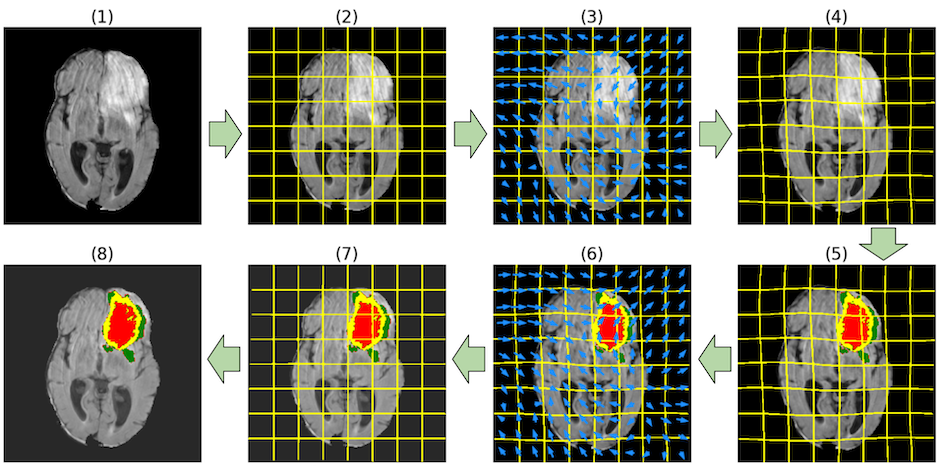

# Medical image segmentation with test-time elastic transformation



## How to run

1. Download BraTS dataset from http://braintumorsegmentation.org/ to `$BRATS_DIR`.
   1. _Optional:_ In order to have a separate validation set, move some samples from `$BRATS_DIR` to a separate directory, e.g. `$BRATS_VALIDATION_DIR`.
1. To train model:
   1. Run:
      ```shell
      python3 main.py --brats_dir=$BRATS_DIR --output_dir=/path/to/output --brats_validation_dir=$BRATS_VALIDATION_DIR --epochs=1000 --use_cache=True --epochs_per_checkpoint=50
      ```
   1. Tip: run `python3 main.py --help` for the full list of parameters.
   1. At the end of the training, the model will be stored in `checkpoint_epoch1000.pth` under a `--output_dir` subdirectory (the exact path will be in logs).
1. [Main.ipynb](Main.ipynb) demonstrates the results of training.
   1. Set `checkpoint_path` to the checkpoint file created on the previous step and run the notebook.
1. [Valuation.ipynb](Valuation.ipynb) run the main experiment pipeline, i.e. it loads the trained model, runs test-time augmentation on the validation set, calculates final segmentations, and stores them on disk
   1. Set `checkpoint_path` to the checkpoint file created on the previous step, update hyperparameters as needed, and run the notebook.
   1. To calculate segmentation quality metrics for the generated predictions, run:
      ```shell
      python3 main_valuation.py
      ```
1. Additionally, [ElasticTransform.ipynb](ElasticTransform.ipynb) and [TransformVisualization.ipynb](TransformVisualization.ipynb) generate useful visualizations for the elastic tranformation, reverse transformation, predicted segmentations, etc.

## Files of interest

* [model.py](model.py) implements the baseline model (UNet).
